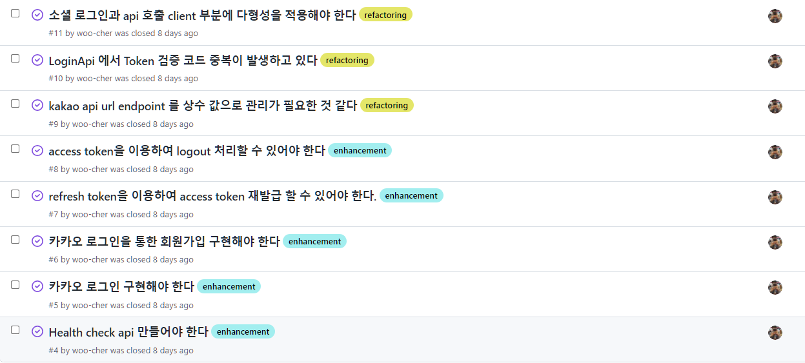
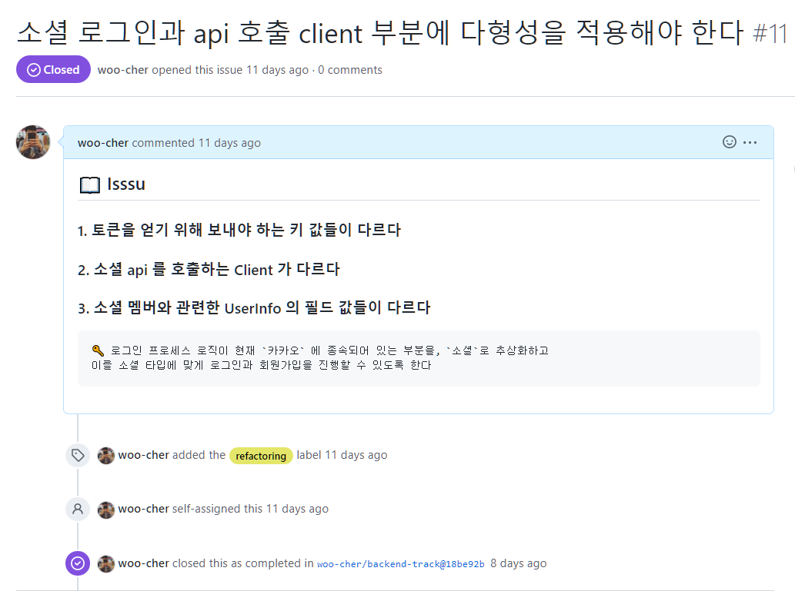
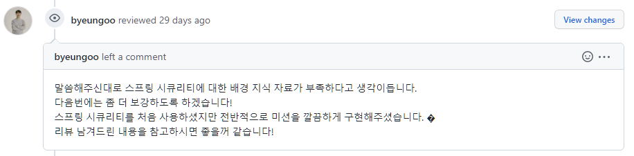
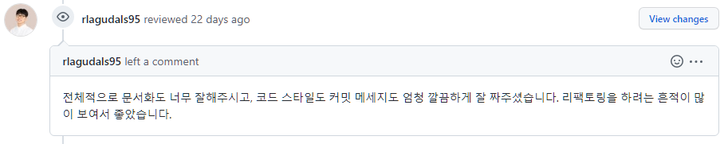
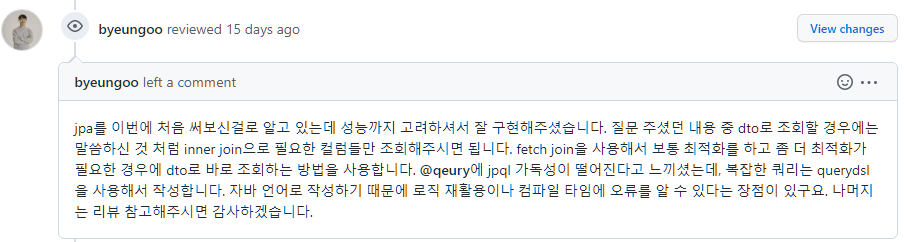
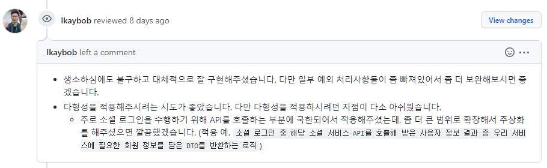
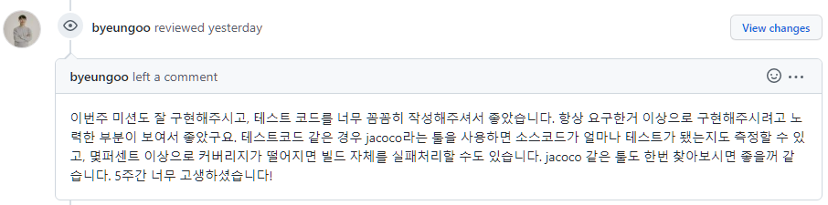

### 👉🏿 **EXTERNSHIP 지원 동기**

> 안녕하세요! 작은 스타트업에서 **1인 개발 환경**에서 2년 근무했던 **주니어 개발자**입니다. 이번 **익스턴십**을 통해 나의 개발 방식에는 어떤 문제가 있는지, 코드 리뷰를 통해 얻을 수 있는 것은 무엇인지, 그리고 처음 사용해보는 기술들에 대해서 익혀 보고 싶어서 **지원**하게 되었습니다. 또한, 이번 경험과 함께 다시 **취업 성공**에 도움이 되었으면 하는 바람입니다 :)

###  👉🏿 **MISSION 접근**

> **JPA, Thymleaf, Gradle** 등 처음 사용해보는 기술들이 많았기 때문에 곧 바로 기능을 구현하지는 않았습니다. 공식 문서와 가이드 예제 코드를 작성해보면서 어느 상황에서 사용할 수 있는 부분인지 등을 먼저 익히려고 노력했습니다. 그런 뒤, 구현 해야 되는 요구 사항을 기능 별로 정리해서 구현하는 형태로 접근하였습니다. 또한 매주 **기능 구현**과 더불어 **리팩토링**까지 하는 것을 목표로 잡으려고 노력하였습니다.

<br>

<p id="top">

# **📗 Contents**

</p>

### **1️⃣ [Tech Stack](#1%EF%B8%8F⃣tech-stack)**

### **2️⃣ [Package Structure](#2%EF%B8%8F⃣-package-structure)**

### **3️⃣ [Git issue & commit](#3%EF%B8%8F⃣-git-issue--commit)**

### **4️⃣ [미션 별 Pull Request & 주요 구현 형태](#4%EF%B8%8F⃣-미션-별-pull-request-및-구현-형태)**

### **5️⃣ [Refactoring](#5%EF%B8%8F⃣-refactoring)**

### **6️⃣ [회고](#6%EF%B8%8F⃣-회고-1)**

<br>

# ****1️⃣ Tech Stack****

| Architecture | spring boot, secuirty, rest api |
| --- | --- |
| Server | Embedded Tomcat, Amazon ec2 |
| Build & Deploy | Gradle, Docker, Workflow |
| Database | MariaDB, JPA |
| Front-end | Thymeleaf |
| Other Tools | Github, Feign, Junit5 |

#### [📤 목차로 돌아가기](#contents)

<br>

# 2️⃣ ****Package Structure****

```
Based on - Module Lawyer

📦 backend-track
┣ 📦 project-lion-api / project-lion-web
┃ ┣ 📂 com.shop.projectlion
┃ ┃ ┣ 📂 api
┃ ┃ ┃ ┣ ...
┃ ┃ ┃ ┗ 📂 login (rest-contorller, service ...)
┃ ┃ ┣ 📂 domain
┃ ┃ ┃ ┣ ...
┃ ┃ ┃ ┗ 📂 item (item dto, repostiory ...)
┃ ┃ ┣ 📂 global
┃ ┃ ┃ ┣ 📂 config
┃ ┃ ┃ ┣ 📂 error
┃ ┃ ┃ ┗ ...
┃ ┃ ┣ 📂 infra
┃ ┃ ┣ 📂 web
┃ ┃ ┃ ┣ ...
┃ ┃ ┃ ┗ 📂 login (contorller, service ...)
┣ ┃ 📂 recources
┃ ┗ ┗ 📂 templates (html, css, js ...)
┗ 📂 test
```

#### [📤 목차로 돌아가기](#1tech-stack)

<br>

# 3️⃣ Git issue & commit

<br>

> 👉🏿 **Git issue 와 commit 활용**
> 
> 우선 매주 구현해야 하는 요구 사항들을 분리하여 이슈 단위로 관리하였습니다. 그런 후에, 개발 유형에 따라 `commit` 메시지에 `행위`를 포함하여 작성하는 형태로 프로젝트에 `push` 하였습니다. 이를 통해 `commit` 메세지로 하여금 **동료** 또는 **본인**이 **어떤 행위**와 **작업**을 진행했는지, 혹은 어떤 **이슈**를 해결하고자 하였는지 알 수 있도록 하고자 하였습니다.

> 💡 **`Git iusse`** 활성화 하는 방법을 뒤늦게 확인하여, **4주차 미션부터** `git issue` 와 **`commit`** 을 연계 처리 하였습니다.

<details>
<summary><h3 style="display: inline">👥 Issue 관리</h3></summary>
<div markdown="1">

- 미션 구현 이전에 `기능 개발`과 `리팩토링` 이 두 분류의 이슈로 요구 사항에 대해 먼저 정리하고 진행하려고 하였습니다. 이를 통해 작업을 **세분화**해서 꼼꼼하게 처리하려고 노력했습니다.





</div>
</details>

<details>
<summary><h3 style="display: inline">👥 개발 유형에 따른 commit 적용</h3></summary>
<div markdown="1">

- **기능 개발 (feat)**

```
"feat: refresh token 을 이용한 access token 재발급 - close #7"
```

- `**버그` 혹은 `오류` 에 대한 수정 (fix)**

```
"fix: login api 매개 변수 오류로 인해 타입 롤백 처리"
```

- **코드 리팩토링 (refact)**

```
"refact: 중복이 발생하는 Token 검증 로직을 메소드로 분리 - close #10"
```

#### [📤 목차로 돌아가기](#1tech-stack)

</div>
</details>

<br>

# 4️⃣ 미션 별 Pull Request 및 구현 형태 

<br>

> 💡 **코드량이 많은 상세 구현 형태의 경우, 내용 길이 관계 상 따로 정리하지 않았습니다!**

<details>
<summary><h2 style="display: inline">⭐ WEEK 1</h2></summary>
<div markdown="1">

<br>

**✅ 프로젝트 초기 세팅**

**✅ 네비게이션바, 푸터, 쇼핑몰 공통 레이아웃**

**✅ 회원가입 / 로그인 / 로그아웃**

<details style="padding-left: 2%">
<summary><h3 style="display: inline">Pull Request</h3></summary>
<div markdown="1">

> 🔗 **[1주차 미션 제출 (임우철)](https://github.com/woo-cher/backend-track/pull/1)**
> ## 접근방법
> - 처음 사용해보는 기술들이 있어서 기술 별 document 과 배경 지식 파일을 보면서 구현했습니다
> - 기본으로 주어진 클래스들을 최대한 이용하려고 하였습니다
> - 기능 요구 사항 화면대로 구현하려고 했습니다
> ## 특이사항
>
> - 1주차 미션 중 접근하기 가장 접근하기 어려운 부분이 **secuirty** 였는데요. 배경지식 파일에 이 부분에 대한 정보가 부족하게 느껴져서 아쉬웠습니다.
> - 회원가입 관련 오류 메시지의 경우는 validation 을 통해 처리하라는 내용이 있었는데, login 관련 오류의 경우는 무엇으로 처리해야 하는 지에 대한 부분이 없어서 아쉬웠던 것 같아요.

- **강사님 코드 리뷰 의견**



</div>
</details>

> 👉🏿 **1주차 미션 접근 방식**
>
> 1주차에서는 **secuirty** 에서 기본으로 정의된 `UserDetails` 를 사용하지 않고, 내 서비스에서 구성한 `member` 엔터티를 커스텀해서 회원 로직에 적용하는데 중점을 두고 구현하였습니다.
>
> **레이아웃의 경우** jsp 파일에서 include 형태로 처리하는 방식이 thymleaf 에도 있을 것이라고 생각하였습니다.그래서 `dialect` 라는 오픈소스를 찾았고, 이를 통해 `thymeleaf` 공식 문서와 함께 레이아웃을 구성하였습니다.

### **📖 주요 구현 형태**

<details style="padding-left: 2%">
<summary><h3 style="display: inline">Front layout</h3></summary>
<div markdown="1">
- 헤더, 푸터 등을 조각(fragment) 으로 나누고 **[thymeleaf-layout-dialect](https://github.com/ultraq/thymeleaf-layout-dialect)** 라이브러리를 이용해 위 조각들을 모아서 구성

```html
<html lang="ko" ... xmlns:layout="http://www.ultraq.net.nz/thymeleaf/layout">
...
<body>
    <!-- header -->
    <header th:replace="/layout/fragments/header :: headerFragment"></header>

    <!-- content -->
    <div layout:fragment="content"></div>
		...
</body>
</html>
```
</div>
</details>

<details style="padding-left: 2%">
<summary><h3 style="display: inline">Spring Security</h3></summary>
<div markdown="1">

- UserDetail 를 서비스 내 `Member` 로 재정의

```java
public class UserDetailsImpl implements UserDetails {
		private final Member member;

		...

		@Override
    public Collection<? extends GrantedAuthority> getAuthorities() {
        Set<GrantedAuthority> roles = new HashSet<>();
        roles.add(new SimpleGrantedAuthority("ROLE_" + member.getRole().name()));
        return roles;
    }

		...
}
```

</div>
</details>

<details style="padding-left: 2%">
<summary><h3 style="display: inline">Validation</h3></summary>
<div markdown="1">

- 엔터티 필드 검사의 경우 `javax.validaton` 를 이용해 처리

```java
@Getter @Setter
public class MemberRegisterDto {

    @NotBlank(message = "이름은 필수 값입니다.")
    private String name;

    @NotBlank(message = "이메일은 필수 입력 값입니다.")
    @Email(message = "이메일 형식이 올바르지 않습니다.")
    private String email;

    @NotBlank(message = "비밀번호는 필수 입력 값입니다.")
    @Length(min = 8, max = 16, message = "비밀번호는 8자 이상, 16자 이하로 입력해주세요")
    private String password;
		
    ...
}
```

```html
<!-- (front) show error message -->
<span class=".." th:if="${#fields.hasErrors('name')}" th:errors="{name}"></span>
```

</div>
</details>

</div>
</details>

<br>
<details>
<summary><h2 style="display: inline">⭐ WEEK 2</h2></summary>
<div markdown="1">

✅ 인증 여부 / 권한에 따른 메뉴 노출 제어

✅ 상품 등록 / 조회 / 수정

<details style="padding-left: 2%">
<summary><h3 style="display: inline">Pull Request</h3></summary>
<div markdown="1">

> 🔗 **[2주차 미션 제출 (임우철)](https://github.com/woo-cher/backend-track/pull/2)**
>
> ## **미션 체크리스트**
>
> ✅ 로그인 시 ADMIN 권한을 가진 회원의 경우 네비게이션바에 “상품 등록” 메뉴 노출 (회원의 ROLE 이 ADMIN인 경우)
>
> ✅ 상품 등록
>
> ✅ 상품 조회 **(상품 수정 페이지)**
>
> ✅ 상품 업데이트 **(상품 수정 페이지)**
>
> ## 접근방법
>
> - JPA 를 처음 써보는데 관계 매핑 하는 것 부터 어려워서 애를 많이 먹었습니다. 그래서, doc 외 여러 자료들을 참고하면서 최대한 맞는 방향으로 설계하려고 노력하였습니다
> - 엔터티간 관계가 형성 되면서 불필요한 쿼리 로그가 많이 찍히는 것 같았습니다. 그래서, 처음에 기능을 만들면서 불필요한 쿼리를 실행하지 않도록 하는 방향으로 생각을 하려고 했습니다.
> - 상황에 맞는 cascade 정책을 적용해보려고 했습니다. 예) 상품 삭제 시 상품과 관련된 이미지 데이터가 모두 삭제 하기 위해 ~REMOVE 적용
> - 상황에 따라 엔터티 또는 Dto 를 사용해서 필요한 데이터만을 사용하려고 노력했습니다.
>
> ## 특이사항
>
> - 기술들을 충분히 실습하고 써보면서 미션에 적용하고 싶었는데 시간이 생각보다 여유롭지 않아서 제대로 적용하지 못한 것 같아 아쉽습니다
> - 연관 관계가 있는 엔터티를 save 할 때 영속성을 이용해서 코드를 줄이고 싶었는데 잘 사용하지 못해 아쉽습니다
> - CRUD 작접을 하다 보니까 Entity <--> Dto 로 서로 변환해야 하는 경우가 많이 있었습니다. 이 부분에서 메소드 네이밍이나 코드 리팩토링을 하지 못해서 가독성이 많이 부족한 것 같아 아쉽습니다.

- **강사님 코드 리뷰 의견**



</div>
</details>

> 👉🏿 **2주차 미션 접근 방식**
>
> 이번 과정에서 **`JPA`** 를 처음 사용해보는 것이었기 때문에 기본적인 관계 매핑부터 쿼리가 어떤 형태로 날라가는 것인지 등을 먼저 실습 해보았습니다.
>
> 후에 미션을 구현할 때에는 `최대한 작은 횟수 쿼리로 필요한 데이터만 모두 조회` 하는 방향과 `쿼리 조회 반환 타입을 DTO 로 바로 반환해서, 불필요한 컬럼은 조회하지 않는` 방향을 중점적으로 신경쓰면서 개발하려고 노력했습니다.

### **📖 주요 구현 형태**

<details style="padding-left: 2%">
<summary><h3 style="display: inline">Interface-Based Projections</h3></summary>
<div markdown="1">

- DTO 로 쿼리 결과를 매핑하여 필요한 컬럼만 조회

```java
// 엔터티로 조회가 필요한 경우, 메소드 재사용을 위해 제네릭 타입 사용
public interface DeliveryRepository extends JpaRepository<Delivery, Long> {
    <T> List<T> findAllByMemberId(long memberId, Class<T> clazz);
}

// use
public List<DeliveryDto> findAllDeliveryByMember(long id) {
    return deliveryRepository.findAllByMemberId(id, DeliveryDto.class);
}
```

</div>
</details>

<details style="padding-left: 2%">
<summary><h3 style="display: inline">Custom Validator</h3></summary>
<div markdown="1">

- 특수 필드 값 유효성 검사를 위해 Custom Validator 구현

```java
@Component
public class UpdateItemValidator implements Validator {

    @Override
    public boolean supports(Class<?> clazz) {
        ...
    }

    @Override
    public void validate(Object target, Errors errors) {
        ...
    }
}
```

</div>
</details>

</div>
</details>

<details>
<summary><h2 style="display: inline">⭐ WEEK 3</h2></summary>
<div markdown="1">

**✅ 메인 페이지 상품 조회 (Paging)**

**✅ 상품 상세 페이지 조회**

**✅ 주문 생성 / 조회 / 취소 구현하기**

<details style="padding-left: 2%">
<summary><h3 style="display: inline">Pull Request</h3></summary>
<div markdown="1">

> 🔗 **3[주차 미션 제출 (임우철)](https://github.com/woo-cher/backend-track/pull/3)**
>
> ## **미션 체크리스트**
>
> ✅ **메인 페이지 상품 조회 구현**
>
> ✅ **상품 상세 페이지 조회 구현**
>
> **✅ 주문 하기 구현**
>
> **[추가 과제]**
>
> **✅ 주문 이력 조회**
>
> **✅ 주문 취소**
>
> ## 접근방법
>
> - 필요한 몇 개의 컬럼 데이터만을 추출하기 위해서 주어진 DTO와 Repository 를 매핑하여 곧바로 사용할 수 있도록 신경 쓰면서 진행했습니다.
> - `Fetch Join` 을 사용해서 모든 컬럼을 조회하기 보다는 `Inner Join` 을 사용하여 필요한 컬럼만 조회하도록 쿼리를 구성했습니다
> - update 작업의 경우, 엔터티 영속성을 활용해서 만들어보려고 노력했습니다
>
> ## 특이사항
>
> - 일부 Controller 에서 ResponseEntity 형태로 리턴하고 있는데, 차후 이러한 형태가 많아지게 되면 해당 부분은 글로벌 핸들러로 리팩토링 할 예정입니다
> - 이미지가 불러와지지 않는 문제가 있었습니다. 단순한 문제였는데, 크롬 문제로 생각하고 이래 저래 시간을 많이 소비한 게 아쉽습니다.
> - 재고가 부족한 상황을 Front 에서 처리할 수 있었다는 걸 뒤늦게 보았습니다. 이걸 모르고 저는 서버 단에서 재고 컬럼 값을 조회해서 처리를 해버렸네요.. 아쉽습니다.
>
> ## ****궁금한 점****
>
> - 여러 관계 컬럼들을 조회할 때, 어떤 방향으로 접근해야 하는지 아직 감이 잘 오지 않습니다.. 기본 join 문법으로 필요 컬럼만을 조회하는 것이 옳은 방향인지 잘 모르겠습니다. JPA 가 참 어렵네요 ㅠ
> - 이번 주차에는 **`@query`** 를 많이 사용해서 직접 쿼리문을 작성하였는데, 쿼리가 길어짐에 따라 가독성 부분에서 많이 아쉬움이 느껴졌습니다. 이 부분에 대해서는 보통 어떻게 처리 하는 걸까요??

- **강사님 코드 리뷰 의견**



</div>
</details>
    
> 👉🏿 **3주차 미션 접근 방식**
>
> DTO 에 여러 연관 관계 엔터티 필드 데이터가 필요한 경우 **`fetct join`** 을 사용하려고 했습니다.
> 이 과정에서 불필요한 컬럼 데이터까지 가져오는 **(over fetching)** 현상을 발견하였습니다. 그래서, **`inner join`** 쿼리를 직접 작성하는 형태로 구현하여 필요한 컬럼 데이터만 추출하는데 중점을 두고 구현하려 노력하였습니다.

### **📖 주요 구현 형태**

<br>
<details style="padding-left: 2%">
<summary><h3 style="display: inline">Inner Join</h3></summary>
<div markdown="1">

- **반환 타입을 DTO 로 매핑**
- **`Inner join` 쿼리를 직접 작성하여 필요한 컬럼만 조회**

```java
// ItemRepository.java

@Query("SELECT new com.shop.projectlion.web.main.dto.MainItemDto(i.id, i.itemName, i.itemDetail, it.imageUrl, i.price) " +
        "FROM item i JOIN item_image it ON i.id = it.item.id " +
        "WHERE i.itemSellStatus = 'SELL' AND it.isRepImage = true " +
        "AND (i.itemName LIKE %:query% OR i.itemDetail LIKE %:query%)")
Page<MainItemDto> findAllBySearchQuery(@Param("query") String searchQuery, Pageable pageable);
```

</div>
</details>

<details style="padding-left: 2%">
<summary><h3 style="display: inline">Custom Exception</h3></summary>
<div markdown="1">

- **오류 메시지에 특정 `param` 값을 넣어서 예외를 던지기 위해 생성자를 아래와 같이 정의**

```java
@Getter
public class BusinessException extends RuntimeException {
    private final ErrorCode errorCode;

    ...

    public BusinessException(ErrorCode errorCode, String append) {
        super(errorCode.getMessage() + append);
        this.errorCode = errorCode;
    }
}
```

```java
// use
if (item.getStockNumber() < insertOrderDto.getCount()) {
    throw new BusinessException(ErrorCode.NOT_ENOUGH_STOCK_NUMBER, stockNumberErrorMessage(item.getStockNumber()));
}
```

</div>
</details>

<details style="padding-left: 2%">
<summary><h3 style="display: inline">Response Entity</h3></summary>
<div markdown="1">

- **비동기 API 요청 처리 중 오류 발생 시 응답 처리**

```java
@PostMapping("/order")
public @ResponseBody ResponseEntity saveOrder(...) {

    try {
        ...
        return ResponseEntity.ok().build();
    } catch (BusinessException e) {
        ...
        return ResponseEntity.status(e.getErrorCode()
                    .getStatus())
                    .body(e.getMessage());
    }
}
```

```jsx
$.ajax({
    ...
    success  : function(result, status){
        ...
    },

    error : function(jqXHR, status, error){
        if(...) {
            alert(jqXHR.responseText);
        }
    }
});
```

</div>
</details>

</div>
</details>

<details>
<summary><h2 style="display: inline">⭐ WEEK 4</h2></summary>
<div markdown="1">

**✅ Health Check API 구현**

**✅ 전역 에러 처리 구현**

**✅ 카카오 토큰 발급**

**✅ 소셜 로그인 및 회원가입, JWT 반환**

<details style="padding-left: 2%">
<summary><h3 style="display: inline">Pull Request</h3></summary>
<div markdown="1">

> 🔗 [4**주차 미션 제출 (임우철)**](https://github.com/woo-cher/backend-track/pull/12)
>
> ## **미션 체크리스트**
>
> ### **✅ 미션 1**
>
> - Health check api
>
> ### **✅ 미션 2**
>
> - 카카오 로그인으로 토큰을 획득
>
> ### **✅ 미션 3**
>
> - 발급 받은 카카오 access token을 이용하여 카카오 회원 정보를 불러와서 회원 가입 진행
> - 정상적으로 회원 가입 or 회원 가입 후 다시 로그인 시 access token, refresh token 반환
> - 회원 가입이 안된 회원이면 진행, 아니라면 refresh 토큰 및 만료 시간 갱신
>
> ### **✅ 미션 4**
>
> - jwt 리프레시 토큰으로 엑세스 토큰을 재발급
>
> ### **✅ 미션 5**
>
> - jwt 엑세스 토큰으로 로그아웃 요청
> - 로그아웃 성공 시, 해당 회원의 리프레시 토큰을 만료 처리
>
> ## 접근방법
>
> - api 서버를 별도로 두고 소셜 로그인과 jwt 토큰 인증 방식을 직접 구현해본 적은 없어서 이해하는데 시간이 많이 걸렸습니다. 그래서 이러한 형태로 구현하는 것이 맞는 방향인지 감이 잘 오질 않았습니다
> - **Feign Client** 를 써보면서 외부 api 호출에 대한 편의성을 느낄 수 있었습니다. 그리고, api 요청에 필요한 파라미터가 많은 경우 dto 등의 객체 필드를 매핑해서 요청 파라미터에 전달될 수 있게 하려고 하였습니다.
> - 처음에는 `kakao` 소셜 로그인에 종속 된 체로, 로그인 프로세스를 구현한 뒤 차후 `Naver`, `Kakao` 등의 소셜 로그인을 같이 사용할 수 있도록 리팩토링 했습니다.
> - secuirty 를 얹으면, 많이 복잡해질 것 같아서 사용하지 않았습니다.
>
> ## 특이사항
>
> - 전 주차의 pull req 와 merge 후, 리팩토링 누락된 부분이 있어서 이번 주차에 함께 포함되어 버린 점 양해 부탁드립니다 ☹️
> - `Header` 토큰 값 존재 여부 판단의 경우 `Interceptor` 를 구현하려 했으나, 차 주 미션에 포함 되어 있다고 하셔서 우선 `GlobalHandler` 에 구현하였습니다.

- **강사님 코드 리뷰 의견**



</div>
</details>

> 👉🏿 **4주차 미션 접근 방식**
>
> - **`소셜로그인`**, **`jwt token`** 을 직접 구현해본 적이 없어서 개념을 먼저 이해하려고 하였습니다.
>
> - 요구 사항에는 **`카카오`** 밖에 없었지만, **`네이버`**, **`구글`** 등의 다른 소셜 객체에 대한 부분도 염두하고 소셜 로그인에 **`추상화`** 개념을 적용하는데 까지 목표를 잡았습니다
>
> - **`Feign client`** 로 api 요청 시, **dynamic url** 을 적용하여 하나의 **`client interface`** 로 모든 api 요청을 처리하려고 했습니다.

### **📖 주요 구현 형태**

<details style="padding-left: 2%">
<summary><h3 style="display: inline">Social 로직 추상화</h3></summary>
<div markdown="1">

- **Social 로직의 공통 행위를 아래와 같이 추상화**

```java
public interface SocialLoginClient {
    SocialTokenResponseDto getSocialTokenByAuth(SocialTokenReqDto socialTokenReqDto);
    SocialMemberInfo getSocialMemberInfoByToken(URI baseUrl, String socialAccessToken);
}
```

```java
public interface SocialMemberInfo {
    String getSocialName();
    String getSocialEmail();
}
```

- **Factory 패턴을 이용하여, 추상화 객체에 실제 행동 객체를 주입**

```java
public class SocialApiClientFactory {

    private final KakaoLoginFeignClient kakaoLoginFeignClient;

    public SocialLoginClient getSocialLoginClient(MemberType memberType) {
        
        return switch (memberType) {
            case KAKAO -> kakaoLoginFeignClient;
            case NAVER, GOOGLE, GENERAL -> null;
        };
    }

}
```

```java
**// use**
public class SocialLoginService {

    private final SocialApiClientFactory apiClientFactory;

    public SocialTokenResponseDto getSocialToken(MemberType memberType, SocialTokenReqDto socialTokenRequestDto) {
        SocialLoginClient client = apiClientFactory.getSocialLoginClient(memberType);
        return client.getSocialTokenByAuth(socialTokenRequestDto);
    }

    ...
}
```

</div>
</details>

<details style="padding-left: 2%">
<summary><h3 style="display: inline">Feign Client 요청 파라미터가 많은 경우 처리</h3></summary>
<div markdown="1">

- SpringQueryMap 을 이용하여, 파라미터를 DTO 객체로 요청

```java
@FeignClient(url = "..", name = "..")
public interface SomeClient {

    @PostMapping(value = "..", headers = "..")
    SomeDto getSomething(**@SpringQueryMap** ReqDto reqDto);

}
```

</div>
</details>

<details style="padding-left: 2%">
<summary><h3 style="display: inline">Feign Dynamic url</h3></summary>
<div markdown="1">

- **동일 소셜 api 내에서 url host 가 다른 경우 dynamic url 처리**

```java
@FeignClient(url = "..", name = "..")
public interface FooClient {

    // Api Client dynamic url -> "baseUrl/bar"
    @PostMapping(value = "/bar")
    SomeFooDto getSomething(URI baseUrl, String param);
}
```

</div>
</details>

</div>
</details>

<details>
<summary><h2 style="display: inline">⭐ WEEK 5</h2></summary>
<div markdown="1">

**✅ 상품 등록 / 조회 / 수정 API 구현**

**✅ 상품 수정 테스트 코드 작성**

**✅ Swagger 를 이용한 API 문서화**

**✅ 자동 배포 설정 (CI/CD)**

<details style="padding-left: 2%">
<summary><h3 style="display: inline">Pull Request</h3></summary>
<div markdown="1">

> 🔗 [**5주차 미션 제출 (임우철)**](https://github.com/woo-cher/backend-track/pull/21)
>
> ## **미션 체크리스트**
>
> **✅ 미션 1 : 인증 인터셉터**
>
> **✅ 미션 2 : 인가 인터셉터**
>
> **✅ 미션 3 : 상품 조회 API 구현**
>
> **✅ 미션 4 : 상품 업데이트 API 구현**
>
> **✅ 미션 5 : 상품 수정 테스트 코드 작성**
>
> **✅ 미션 6 : swagger 상품 수정 API 문서화**
>
> **✅ 미션 7 : CI/CD**
>
> ## 접근방법
>
> - docker, workflow 등 처음 사용해보는 부분이 많아서 주어진 배경 지식을 최대한 숙지하고 사용하려 했습니다.
> - 배포를 실습 하는 과정에서 여러 오류 들을 만나서, 이를 해결하기 위해 여러 케이스를 찾아보고 해결하려고 했습니다.
> - 상품 조회의 경우, 여러 엔터티들과 연관 관계를 가지고 있기 때문에, `fetch join` 을 활용하였습니다.
> - 테스트 코드를 통해 기능적 검증 뿐만 아니라, 예외 상황에 대한 검증 케이스도 생각해보고 코드를 작성하려고 노력했습니다. 그리고, Mock 객체를 이용한 테스트 코드를 다른 영역에서도 활용해보기 위해 Interceptor 테스트 코드를 작성해보았습니다.
>
> ## 특이사항
>
> - 미션에서 구현해야 하는 부분을 먼저 구현하고 추가적으로 다른 API 문서화 및 테스트 코드를 신경 쓰고 싶었습니다. 하지만, CI/CD 를 이용한 배포를 하는 과정에서 여러 오류를 겪어 시간을 많이 소비하게 되어 아쉽습니다.
> - 깃에 올리지 않는 설정 파일인 `env.properties` 를 배포 시에 찾지 못해서 ec2 서버가 가동되지 않았습니다. 이 부분을 해결하기 위해서, 여러 모로 찾아보았지만 실패하였습니다. 결국 답안을 찾지 못해서 해당 파일을 git 에 업로드 하게 되었습니다.
> - 마무리 하고 코드 리팩토링에 시간을 많이 투자 못해서 아쉽네요 :(
>
> ## ****궁금한 점****
>
> • 저는 여태껏 민감한 정보를 숨기기 위해 로컬에서 따로 관리하는 형태로 `env.properties` 파일을 두었었는데요. 그리고 이는 `.gitignore` 처리된 파일입니다. 배포를 하면 해당 파일을 찾지 못해 서버가 가동이 되지 않는데요. 해당 `env.properties` 를 빌드 시 추가해줄 수 있는 방법이 있을까요??

- **강사님 코드 리뷰 의견**



</div>
</details>

> 👉🏿 **5주차 미션 접근 방식**
>
> 이번 미션을 보고 제일 관심이 갔던 부분은 `**테스트 코드**`입니다. **여태 테스트 코드를 혼자 짜왔었고** 누군가에게 **`피드백`**을 받아 본 적이 없었기 때문에 더욱 그랬던 것 같습니다. 그렇기에, 기본 요구 사항의 테스트 코드와 더불어 **인터셉터 영역까지 테스트 코드를 한번 작성해보는데 중점**을 두고 미션을 진행하였습니다.
>
> 또한, CI/CD 자동화의 경우 내용이 많았기 때문에 (docker, workflow.. ) 단계별로 천천히 진행해보면서 배포까지 우선 성공하는데 목표를 두었습니다.

### **📖 주요 구현 형태**

<details style="padding-left: 2%">
<summary><h3 style="display: inline">TEST CODE</h3></summary>
<div markdown="1">

- **Spring 을 띄우지 않고 Mocking 을 활용**

```java
// Controller test 예제
public class AdminItemControllerTest {

    @InjectMocks
    AdminItemController adminItemController;

    @Mock
    AdminItemService adminItemService;
	
    @BeforeEach
    void setup() {
            ...
    }

    @Test
    @DisplayName("상품 조회 API Test")
    void readHandle() throws Exception {
        ReadItemDto mockDto = ReadItemDto.builder().build();

        // given
        given(adminItemService.findItemById(anyLong())).willReturn(mockDto);

        // when
        ResultActions result = mockMvc
                                .perform(get("/api/admin/items/{itemId}", anyLong());

        // then
        result.andExpect(content().json(objectMapper.writeValueAsString(mockDto)));
    }
}
```

- **`Controller`** 계층 테스트 시 **요청**, **응답** **`body`** 를 아래와 같이 비교

```java
@Test
void test() {
    ResultActions result = mockMvc.perform(patch(...).content(jsonData));
    result.andExpect(content().json(jsonData)));
}
```

- **특정 예외 상황을 발생 시켜서 예외가 발생하는 지 검증**

```java
@Test
void test() {
    mockMvc.perform(patch(...)
                .content(jsonData))
                .andExpect(r -> assertTrue(r.getResolvedException() instanceof MyException))
                .andExpect(r -> assertEquals(r.getResolvedException().getMessage(), MyMessage))
}
```

- **테스트 그룹화**

```java
class 인터셉터 테스트 {
    
    @Nested
    class 인가 테스트 그룹 {
        ...
    }

    @Nested
    class 인증 테스트 그룹 {
        ...
    }
    
}
```

</div>
</details>

<details style="padding-left: 2%">
<summary><h3 style="display: inline">Authorization Intercetor</h3></summary>
<div markdown="1">

- **`인증 인터셉터`** 검증 과정

> 1. `Authorization` 값이 헤더에 존재하는가?
> 2. 해당 값에서 `Bearer ` 패턴을 찾을 수 있는가?
> 3. 토큰이 유효한가?
> 4. 토큰 유형이 `Access` 인가?
> 5. 토큰이 만료 되었는가?

- **`인터셉터`** 코드 예시

```java
@Test
@DisplayName("Authorization 값에 `Bearer ` 패턴이 없을 때")
void EmptyBearerString() {
    // empty `Bearer ` in header
    given(httpServletRequest.getHeader(HttpHeaders.AUTHORIZATION)).willReturn(mockAccessToken);

    Throwable throwable = catchThrowable(() ->
            authenticationInterceptor.preHandle(httpServletRequest, httpServletResponse, any(Object.class)));

    assertEquals(throwable.getMessage(), ErrorCode.NOT_VALID_BEARER_GRANT_TYPE.getMessage());
    assertTrue(throwable instanceof NotValidTokenException);

    // empty space like `Bearerabce`
    given(httpServletRequest.getHeader(HttpHeaders.AUTHORIZATION)).willReturn("Bearer" + mockAccessToken);

    throwable = catchThrowable(() ->
            authenticationInterceptor.preHandle(httpServletRequest, httpServletResponse, any(Object.class)));

    assertEquals(throwable.getMessage(), ErrorCode.NOT_VALID_BEARER_GRANT_TYPE.getMessage());
    assertTrue(throwable instanceof NotValidTokenException);
}
```

</div>
</details>

</div>
</details>

#### [📤 목차로 돌아가기](#1tech-stack)

<br>

# 5️⃣ Refactoring

<br>

> 💡 리팩토링은 시간을 따로 투자하여 코드를 수정하였습니다. **첫째로** 우선 기능개발을 끝마친 후, 코드를 천천히 다시 읽으면서 리팩토링을 진행하였습니다. 둘째로는 **피어 리뷰** 및 **강사님 리뷰가 끝난 시점**에서 제시해준 의견과 피드백을 적절히 조율하여 리팩토링 했습니다. 더 이상 수정할 부분이 보이지 않는 경우, 다음 미션을 진행하는 형태로 했습니다.

- **refactoring 적용 고려 대상**

```
1. 잘못된 메소드, 변수명 혹은 패키지 경로
2. 사용하지 않는 메소드, 변수명
3. 중복이 발생한 비즈니스 로직을 메소드 혹은 클래스로 분리
4. 클래스의 책임이 올바르지 않은 경우
5. 코드량을 줄일 수 있는 로직
6. 추상화 할 수 있는 로직
```

<details style="padding-left: 2%">
<summary><h3 style="display: inline">소셜 로그인 추상화 리팩토링 과정 살펴보기</h3></summary>
<div markdown="1">

> 1️⃣ 미션에는 **`카카오`** 소셜 로그인을 구현해야 했습니다. 이에 따라, **우선** `카카오` 토큰을 획득하고, 사용자 정보를 받아와 로그인하는 기능을 먼저 개발하였습니다.

- **로그인 서비스 (현재 Kakao 라는 소셜 미디어에 종속되어 있음)**

<p id="original-code">

```java
@Service
public class LoginService {

    ...
    
    private final KakaoLoginFeignClient kakaoLoginFeignClient;

    @Transactional
    public TokenDto loginProcess(String memberType, String kakaoAccessToken) throws URISyntaxException {

        URI kApiUri = new URI(KakaoEndpoints.KAPI);
        KakaoUserInfo* kakaoUserInfo = kakaoLoginFeignClient.getKakaoUserByToken(kApiUri, kakaoAccessToken);

        String email = kakaoUserInfo.getKakaoAccount().getEmail();
        Optional<Member> dbMember = memberRepository.findByMemberTypeAndEmail(MemberType.create(memberType), email);

        TokenDto tokenDto = tokenManager.createTokenDto(email, Role.USER);

        ...

        return tokenDto;
    }
}
```
</p>

#### [📤 **리팩토링 된 코드 보기**](#newCode)

> 2️⃣ 그런 뒤, 타 소셜 미디어인 `Naver`, `Google` 이 추가 될 수도 있다는 부분을 생각하여 공통 행위를 정리하고 추상화 인터페이스를 추가하였습니다.

- **공통**으로 묶을 수 있는 영역을 아래와 같이 정리

> 1. **소셜 토큰**을 획득하는 행위, **사용자 정보**를 가져오는 행위
> 2. 소셜 객체와 Feign clint 객체는 **KAKAO, NAVER, GOOGLE** 로 분류 된다.
> 3. 각 소셜 api 에서 사용자 정보 값으로 **email** 과 **name** 을 가져온다

- **공통 행위 추상화 인터페이스** 추가

```java
public interface SocialLoginClient {

    SocialTokenResponseDto getSocialTokenByAuth(SocialTokenReqDto socialTokenReqDto);
    SocialMemberInfo getSocialMemberInfoByToken(URI baseUrl, String socialAccessToken);

}

public interface SocialMemberInfo {

    String getSocialName();
    String getSocialEmail();

}
```

<aside>
3️⃣ 그리고 각 소셜 객체가 추상 인터페이스를 상속 받도록 하였습니다.

</aside>

- 추상화 상속

```java
@FeignClient(...)
public interface KakaoLoginFeignClient extends SocialLoginClient {

    @PostMapping(value = "..", consumes = ...)
    SocialTokenResponseDto*** getSocialTokenByAuth(@SpringQueryMap SocialTokenReqDto socialTokenReqDto);

    @PostMapping(value = "..", consumes = ...)
    KakaoUserInfo getSocialMemberInfoByToken(...) String socialAccessToken);

}
```

```java
public class KakaoUserInfo implements SocialMemberInfo {
    ...

    @Override
    public String getSocialName() {
        ...
    }

    @Override
    public String getSocialEmail() {
        ...
    }
}
```

> 4️⃣ 다음으로 팩토리를 만들어, 소셜 타입 **(kakao, naver .. )** 등에 따라 실 행동 객체를 생성해주는 책임을 지도록 하였습니다.

- 소셜 `api client` 팩토리

```java
public class SocialApiClientFactory {

    private final KakaoLoginFeignClient kakaoLoginFeignClient;

    public SocialLoginClient getSocialLoginClient(MemberType memberType) {
        
        return switch (memberType) {
            case KAKAO -> kakaoLoginFeignClient;
            case NAVER, GOOGLE, GENERAL -> null;
        };
    }

}
```

> 5️⃣ 이제, 만들어 둔 재료들을 **소셜 서비스** 로이어에 모아서 추상화 개념으로 로직을 만들어주었습니다.

- **SocialLoginService** ( 더 이상 kakao 에 종속 되지 않음 )

```java
public class SocialLoginService {

    private final SocialApiClientFactory apiClientFactory;
    private final SocialApiEndPointFactory apiEndPointFactory;

    public SocialTokenResponseDto getSocialToken(MemberType memberType, SocialTokenReqDto socialTokenRequestDto) {
        SocialLoginClient client = apiClientFactory.getSocialLoginClient(memberType);
        return client.getSocialTokenByAuth(socialTokenRequestDto);
    }

    public SocialMemberInfo getSocialMemberInfo(MemberType memberType, String socialAccessToken) throws URISyntaxException {
        SocialLoginClient socialLoginClient = apiClientFactory.getSocialLoginClient(memberType);

        URI apiHost = apiEndPointFactory.getMemberInfoApiEndPoint(memberType);
        return socialLoginClient.getSocialMemberInfoByToken(apiHost, socialAccessToken);
    }
}
```

> 6️⃣ [**처음 보여드린 코드**](#original-code) 아래와 같이 **`리팩토링`** 되었습니다.
>
> - 소셜 멤버 정보는 `socialLoginService` 가 지도록 했다
> - 소셜 로직이 분리되어 가독성이 올라갔다
> - `LoginService` 는 위의 정보로 로그인 처리 책임만 지면 된다
> - 소셜 타입에 따라 `Kakao`, `Naver`, `Google` 모두 로그인 처리를 할 수 있다. **(추상화)**

<p id="newCode">

```java
public class LoginService {

    private final TokenManager tokenManager;
    private final MemberRepository memberRepository;
    private final SocialLoginService socialLoginService;

    @Transactional
    public TokenDto doSocialLogin(MemberType memberType, String socialAccessToken) throws URISyntaxException {

        SocialMemberInfo socialMemberInfo = socialLoginService.getSocialMemberInfo(memberType, socialAccessToken);
        String email = socialMemberInfo.getSocialEmail();

        Optional<Member> dbMember = memberRepository.findByMemberTypeAndEmail(memberType, email);

        ...
    }
}
```

</p>

#### [📤 처음 코드로 돌아가기](#original-code)

</div>
</details>

#### [📤 목차로 돌아가기](#1tech-stack)

<br>

# 6️⃣ 회고

<details style="padding-left: 2%">
<summary><h3 style="display: inline">새로운 기술의 사용</h3></summary>
<div markdown="1">

> 💡 미션에서 **기술**과 **라이브러리( jpa, thymeleaf, security, jwt, social-token … )** 들이 저에게는 모두 생소한 것들이었습니다. 그래서 매주 미션을 받아도 곧바로 구현할 수가 없었습니다. 그래도, 항상 미션 전에 실습 해보고, 상황 별로 어떤 부분을 적용할 수 있는지 먼저 학습한 뒤에 천천히 요구 사항들을 하나씩 구현했습니다.
> 
> 강사님께 구현하는 형태가 옳은 방향인지 여쭤보기도 하고, 구현하는 방법이 여러가지로 나뉠 때 실무에서는 보통 어떤 방향으로 구현하는지도 물어보곤 하였습니다. 결국 모든 미션 요구사항을 구현해냈고, 열심히 달려온 제 자신이 뿌듯했습니다.
> 
> 무엇이든 **처음 접해본 기술을 가지고 무언가를 만들었을 때면 기분이 정말 좋은 것 같습니다**. 동시에, 다룰 수 있는 기술과 영역이 확장된 걸 느낄 때 게임 캐릭터처럼 레벨이 오른 것 같아 정말 뿌듯합니다!

</div>
</details>

<details style="padding-left: 2%">
<summary><h3 style="display: inline">Mybatis & Jpa</h3></summary>
<div markdown="1">

> 💡 저는 ORM f/w 로 **mybatis** 기술을 사용해왔습니다. 이는 쿼리 작성, 테이블 생성 등 모든 것을 수작업으로 해주어야 하는 반면, `**jpa**` 는`**Entity`** 를 정의하면, 이에 따라 **테이블 생성** 뿐 아니라, **관계 매핑**까지 해준다는 것이 너무 편리했습니다. 또한, 수정 쿼리를 따로 작성하지 않고 **영속성 컨텍스트에 존재하는 엔터티 객체 값을 수정만 해주면 상태 변화를 감지**하여 값을 갱신 해주는 게 너무 편리했습니다!
>
> 평소에 `**jpa`** 를 한번 사용해보자는 마음을 가지고 있었는데, 이번에 jpa 를 다룬 경험을 하게 되어서 너무 좋았습니다!


</div>
</details>

<details style="padding-left: 2%">
<summary><h3 style="display: inline">코드 리뷰와 그룹 피어 리뷰</h3></summary>
<div markdown="1">

> 💡 저의 코드를 누군가에게 **코드 리뷰**를 받는 일이 이번이 처음이었습니다. 남의 코드를 읽으면서 색다른 방법으로 개발한 부분도 알 수 있었고, 작성할 때는 보이지 않았던 요소들을 팀원들이 찾아주기도 하며, 코드 의견을 제시해주는 부분들이 저에게는 너무 좋은 경험이었습니다. 이 경험을 통해서, 코딩 퀄리티가 발전했다는 느낌을 받을 수 있었습니다!!

</div>
</details>

<details style="padding-left: 2%">
<summary><h3 style="display: inline">시간적 여유의 부재</h3></summary>
<div markdown="1">

> 💡 이번 익스턴십에서 새로운 기술을 사용하기 전에 목표로 한 것이 있습니다.  최소한 `**기술에 대한 기본 구조와 어떤 원리로 작동하는지 알고 사용하자**` 가 목표였습니다. 하지만, **시간적으로 생각보다 여유롭지 않아**서 상세하게 들여다보지 못한 체 사용하게 되더라구요. 이러한 부분이 정말 아쉬움으로 남는 것 같습니다.</div>

</details>

<details style="padding-left: 2%">
<summary><h3 style="display: inline">익스턴십을 마치며</h3></summary>
<div markdown="1">

> 💡 평소에 저는 아래와 같은 **의문**들을 가지고 있었습니다. 인터넷에서 쉽게 찾아 볼 수 있는 개념들은 의문을 해소 해줄 만큼 와 닿지 않았습니다.
> - 실무에서 `security` 는 어떻게 사용할까?
> - 내가 짜오던 테스트 코드는 올바른 코드였을까?
> - 실무에서 `back-end`예외 처리는 어떤 식으로 하는 걸까?
> - jwt 토큰을 실제로 백, 프론트 각각 어떻게 구현할까?
> - 소셜 로그인을 하면 뭐가 좋은 걸까?
> - 실무에선 패키지 구조를 어떻게 짤까?
> - Mybatis 가 아닌 JPA 를 사용하면 뭐가 좋을까?**
>
> **하지만** 이번 익스턴십을 통해 직접 사용해보면서 대부분 방향을 찾은 느낌이 들었습니다!! 무엇보다 앞으로 내가 어떤 기술을 이용해 개발을 하고 싶은지 알 수 있었기에 뜻 깊은 경험이었고, 늦은 시간에도 항상 답변 해주신 **변구훈** 강사님께 감사 인사를 드리고 싶습니다 **:)**

</div>
</details>

#### [📤 맨위로 올라가기](#top)

<br>

<h1>감사합니다😄</h1> 
